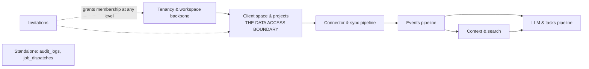
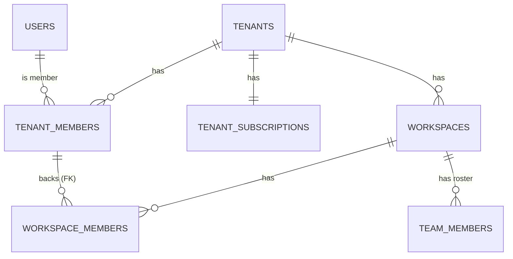
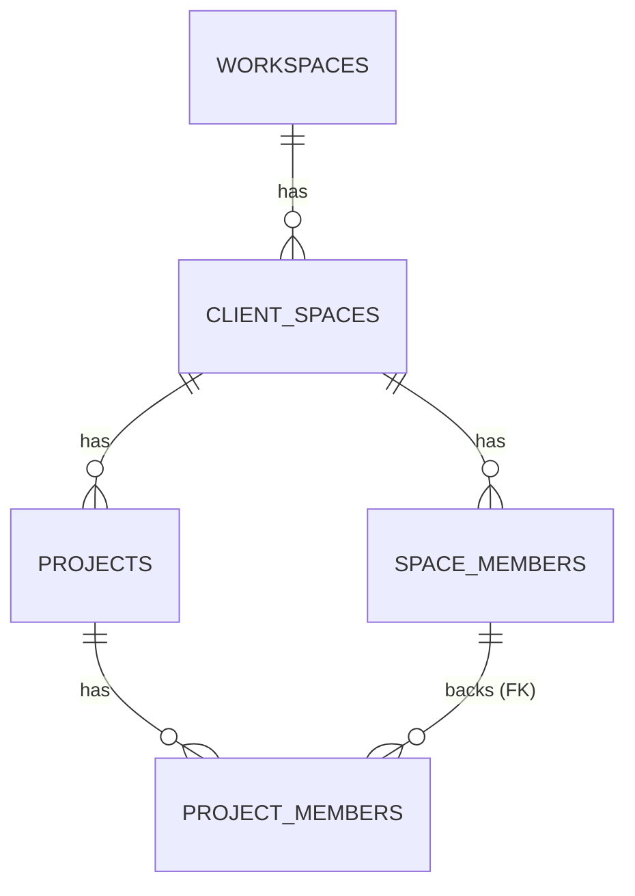
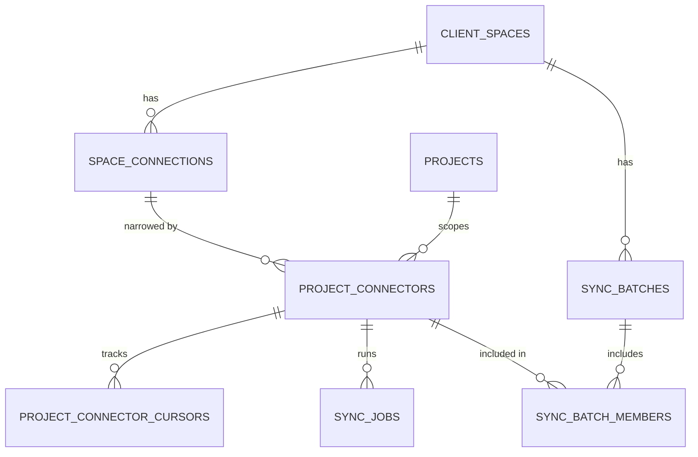
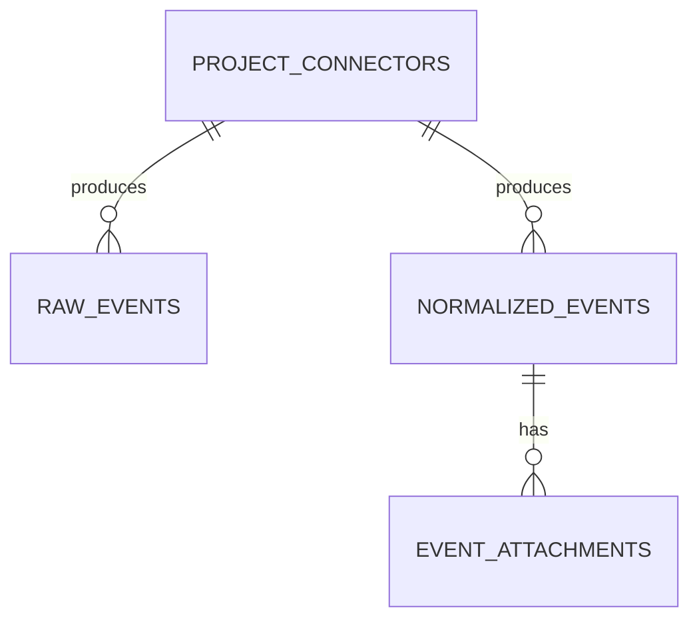
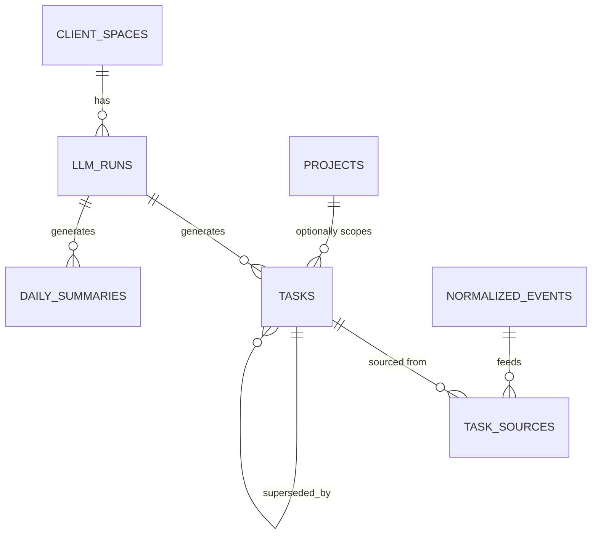

# Database Schema Reference

Reference doc for the `public` schema as defined by `supabase/migrations/20260901000100_extensions.sql` through `20260901002000_client_space_creator_returning_fix.sql` — the "v2 four-level rebuild" on `feature/schema-v2-rebuild`. Read directly off the migration files (not introspection), so every constraint and its *reasoning* is traceable back to a specific file. 29 tables, organized into eight clusters below.

**This replaces an earlier version of this doc that documented the pre-rebuild schema** (`tenant_admins`, `owner_id` columns, `connector_credentials` + `integrations`, `action_items`, `billing_invoices`, `usage_records`, `milestones`) — none of that exists anymore on this branch. If you're looking at application code that still references those names, it hasn't been updated for this rebuild yet (confirmed stale so far: `integrations/actions.ts`, `integrations/page.tsx`, `p/[projectId]/page.tsx`, `data/page.tsx`, plus the pgTAP tests under `supabase/tests/`).

## The big picture

**The one fact that explains most design decisions in this schema:** there are FOUR membership levels, each answering a different question — `tenant_role` (who's on the payroll), `workspace_role` (who can create/manage client spaces and projects — *authority*, not data access), `space_role` (who can actually see this client's ingested data — **the real access boundary**), `project_role` (narrowing within a space, for restricted projects only). A workspace admin can see that a client space *exists* and can manage its shape, but reads none of its content until they add themselves to `space_members` — a visible, auditable row, not ambient access. This is the single biggest change from the pre-rebuild design, where visibility was inherited wholesale from workspace membership.

---

## 1. Tenancy & workspace backbone

`users` mirrors `auth.users` (`users.id → auth.users.id`, provisioned by a trigger on signup) — app-owned profile columns without touching Supabase's managed table directly.

| Table | Purpose | Key columns | Notable constraints |
|---|---|---|---|
| `users` | App-side profile for an authenticated identity | `id` (PK, → `auth.users.id`), `email` (unique, `citext`) | No insert policy — rows are created only by the `auth.users` trigger |
| `tenants` | Top-level billing entity. **No `owner_id` column** — ownership is `tenant_members.role = 'owner'`, deliberately the only source of truth | `id` (PK), `slug` (unique, format-checked), `status` (`active`/`suspended`/`cancelled`, plain `text` + CHECK, not an enum) | Created via the `create_tenant_and_workspace` RPC (see §9), not a direct client insert — see that section for why |
| `tenant_subscriptions` | Stripe state + plan caps, one row per tenant | `tenant_id` (unique), `stripe_customer_id`/`stripe_subscription_id` (unique), `status` | `seats`/`max_workspaces`/`max_client_spaces`/`max_projects` — `null` = unlimited, consistently. Written only by the Stripe webhook via service role |
| `tenant_members` | THE seat roster. FK target for both `workspace_members` and `space_members` — offboarding is one delete that cascades every membership below it | PK `(tenant_id, user_id)` | `role`: `owner`/`billing_admin`/`member`. A last-owner guard trigger blocks removing/demoting the final owner |
| `workspaces` | A team/department inside a tenant. No `owner_id` either | `id` (PK), `tenant_id`, `slug` (unique **per tenant**, not globally) | Composite FK target `(id, tenant_id)` for every child table |
| `workspace_members` | Workspace AUTHORITY — create/manage client spaces, projects, invitations beneath it. Grants **zero** data access on its own | PK `(workspace_id, user_id)` | `role`: `admin`/`member`/`viewer` (no `owner` — that moved up to `tenant_role`). Two composite FKs: to `workspaces(id, tenant_id)` and to `tenant_members(tenant_id, user_id)` — a workspace member cannot exist off the tenant roster |
| `team_members` | Non-login roster contact (client stakeholder, vendor) a task can be assigned to. Confers **no app access** at all | `id` (PK), `workspace_id`, `email` (`citext`, format-checked) | Workspace-scoped, not client-space-scoped: the same stakeholder is often relevant across several engagements one team runs |

---

## 2. Client space & projects — THE DATA ACCESS BOUNDARY

| Table | Purpose | Key columns | Notable constraints |
|---|---|---|---|
| `client_spaces` | The client engagement — level 3, and **the actual data access boundary**. Two clients under one workspace genuinely cannot see each other's Slack/Drive/mail | `id` (PK), `tenant_id`, `workspace_id`, `timezone` (defines "today" for tasks/digests — must not default to server TZ), `context_profile` (short cached-prompt brief, capped at 4000 chars so it doesn't blow the prompt cache), `created_by` | `slug` unique per workspace. `created_by` exists specifically so a just-created space is visible to its creator under RLS (see §9) |
| `space_members` | THE data access boundary, structurally. FK target for `project_members` | PK `(client_space_id, user_id)` | `role`: `admin`/`member`/`viewer`. Composite FKs to `client_spaces(id, tenant_id)` and `tenant_members(tenant_id, user_id)` |
| `projects` | Level 4 — a scoped view over a client space. Does NOT own the OAuth grant (that's the space's, via `space_connections`) but DOES own what gets fetched into it | `id` (PK), `client_space_id`, `workspace_id` (carried only so invitations can prove a workspace-scoped invite names a project inside that workspace — not in any RLS predicate), `visibility` | `visibility`: `'space'` (default — every space member sees it, `project_members` only records role overrides) or `'restricted'` (only users with a `project_members` row see it at all) |
| `project_members` | The narrowing table — elevation for `'space'` projects, an access list for `'restricted'` ones. `role` nullable = "inherit the space baseline" | PK `(project_id, user_id)` | FK to `space_members(client_space_id, user_id)` — a project role can never be granted to someone with no standing in the space (deliberate limitation: no true single-project external guest is expressible) |

**No project `admin` role.** A project has nothing to administer of its own — no membership table, no connector grants, no billing. Administration is a workspace/space concern.

---

## 3. Invitations

The first real invite mechanism this schema has ever had — the pre-rebuild design had no token, no email, no expiry; adding a member meant directly inserting a membership row for someone who'd already signed up independently.

| Table | Purpose | Key columns | Notable constraints |
|---|---|---|---|
| `invitations` | One row can grant membership at multiple levels simultaneously (e.g. a project-scoped invite needs both a `space_role` to get in the door AND a `project_role`) | `id` (PK), `tenant_id` (always set), `workspace_id`/`client_space_id`/`project_id` (nullable, contiguous chain), `email`, `token_hash` (sha256 — plaintext token is emailed, never stored), `tenant_role`/`workspace_role`/`space_role`/`project_role` (any combination) | Scope must be contiguous (no skipping a level); no role deeper than its id; must grant *something*; `expires_at > created_at`. One pending invite per `(tenant, email, exact scope)` |

Acceptance goes through `accept_invitation(token)`, a `SECURITY DEFINER` function that provisions the entire membership chain atomically (tenant → workspace → space → project, in that order, since each level's composite FK requires the one above to exist first). Deliberately does **not** require the accepting user's email to match `invitations.email` — possession of the link is the authorization, so tokens must be treated as secrets.

---

## 4. Connectors & sync pipeline

**This is the biggest structural change from the pre-rebuild design.** The old `connector_credentials` + `integrations` pair is now split into a space-level grant and a project-level narrowing:

| Table | Purpose | Key columns | Notable constraints |
|---|---|---|---|
| `space_connections` | The provider grant — one per connected account, scoped to the CLIENT SPACE (each client space is a distinct provider account: one client's Slack, another's Drive). SERVICE-ROLE ONLY for secrets | `id` (PK), `client_space_id`, `provider`, `auth_mode`, `external_account_id`, `status` | `auth_mode`: `nango` (token custody entirely on Nango's side — this app stores only the connection id) / `api_key` (locally-sealed AES-256-GCM `bytea` secret, for Supabase/OpenAI Codex which have no OAuth dance) / `none` (credential-less, for the `mock` connector). A CHECK constraint enforces each mode carries exactly the fields it needs and none it doesn't. Unique `(client_space_id, provider, external_account_id)` |
| `project_connectors` | What the sync engine actually iterates — narrows one space-level grant down to one project's scope (channels, folders, repos, config, schedule) | `id` (PK), `client_space_id`, `project_id`, `connection_id` → `space_connections`, `config` | Unique `(project_id, connection_id)` — **duplicate ingestion across projects is accepted by design**: nothing stops two projects in one space scoping the same Slack channel, each gets its own cursor and its own copy of every event. `provider` is denormalized here and kept honest by a trigger, not trusted from the client |
| `project_connector_cursors` | Per-resource sync resume position. SERVICE-ROLE ONLY | PK `(project_connector_id, scope_key)`, `cursor` jsonb | One row per project connector per resource (Slack needs one per channel, Drive one per folder) — the ONLY place a resume position lives |
| `sync_jobs` | One row per sync attempt — restored from the pre-rebuild design specifically to keep run history (the redesign as drafted had none) | `id` (PK), `project_connector_id`, `status`, `trigger`, `duration_ms` (generated column) | **At most one live run per connector** — a partial unique index on `status in ('queued','running')` is the actual invariant this table exists to enforce |
| `sync_batches` | Groups the sync jobs that ran for one client space on one calendar day — what `triggerDailyExtraction` waits on before firing the nightly LLM pass | `id` (PK), `client_space_id`, `batch_date` | Unique `(client_space_id, batch_date)`. Batched per client space, not per project — one nightly run covers every project in the space |
| `sync_batch_members` | Join: which project connectors participated in a batch | `id` (PK), `batch_id`, `project_connector_id` | Unique `(batch_id, project_connector_id)` |

All six tables are read-only to authenticated clients (writes are service-role, the sync engine's own bookkeeping) except `space_connections`, which additionally allows client `delete` (disconnect) and a narrow `update` (renaming the display label only) — and even its `select` grant is **column-scoped** to exclude `secret_ciphertext`/`secret_iv`/`nango_connection_id`, since RLS can't restrict columns, only the GRANT can.

---

## 5. Events pipeline

| Table | Purpose | Key columns | Notable constraints |
|---|---|---|---|
| `raw_events` | Untouched provider payload exactly as fetched. SERVICE-ROLE ONLY — zero redaction by definition (DM content, member emails, signed URLs, sometimes provider tokens in webhook bodies) | `id` (app-generated UUIDv7, no DB default), `client_space_id`, `project_id`, `project_connector_id`, `payload` jsonb | **Three-column FK** `(project_connector_id, project_id, client_space_id)` → `project_connectors` — an event cannot claim a project different from the one its connector actually belongs to. No inbound FKs, deliberately, so it stays prunable/partitionable |
| `normalized_events` | Provider-agnostic shape after `Connector.normalize()` — what the LLM reads and the timeline renders. Read-only to clients | `id` (UUIDv7), `client_space_id`, `project_id`, `type` (text + regex CHECK, not an enum — will grow past 50 values), `title`/`body`/`actor_email` (hoisted out of `metadata` because every prompt/timeline row reads them) | `deleted_upstream_at` is a tombstone (content removed upstream lives forever in the timeline, gated not deleted, so task provenance survives); `superseded_by` self-references for edits; unique `(project_connector_id, dedupe_key)` |
| `event_attachments` | Per-attachment extraction state — separate from `normalized_events` because `normalize()` is a pure function that can only *describe* an attachment, never download/parse bytes | `id` (UUIDv7), `client_space_id`, `project_id`, `normalized_event_id`, **`project_connector_id`** (added in `20260901001800_event_attachments_connector.sql` — the download step needs the *specific* connector's credentials, since a project can scope several connectors and using the wrong one just fails with a misleading 401/404), `status` | Unique `(normalized_event_id, provider_attachment_id)` — idempotency for at-least-once job delivery. `storage_path` points into the private `attachments` Storage bucket (service-role only, zero RLS policies) |

---

## 6. Context & search

| Table | Purpose | Key columns | Notable constraints |
|---|---|---|---|
| `context_documents` | Business context, PRDs, meeting notes, glossaries — promoted from a `projects.context_docs` jsonb array to a real table because these now need extraction state and storage refs | `id` (PK), `client_space_id`, `project_id` (nullable — null = applies to the whole space), `kind`, `extraction_status` | Only one LIVE row per source file per scope (`archived_at is null`) — re-upload archives the old row rather than versioning it |
| `search_chunks` | ONE index over events, attachments and context documents — feeds retrieval search AND nightly task dedupe | `id` (PK), `client_space_id`, `project_id` (nullable), `source_kind` + `source_id` (polymorphic, **deliberately no FK** — keeps it prunable alongside `raw_events`), `content`, `fts` (generated tsvector), `embedding` (`halfvec(1024)`) | `embedding_model` recorded per row so a model swap doesn't silently make old vectors incomparable to new ones. HNSW index built while the table is empty (slow/memory-hungry on a populated one) |

---

## 7. LLM & tasks pipeline

| Table | Purpose | Key columns | Notable constraints |
|---|---|---|---|
| `llm_runs` | Full audit record of every model call — prompt, response, token counts, cost. SERVICE-ROLE ONLY | `id` (PK), `tenant_id` (so usage metering is one GROUP BY), `client_space_id`, `kind`, `prompt_version` + `prompt` + `model` (what makes "why did the model say that last Tuesday" answerable after the template's since been edited) | `kind`: `extract`/`reconcile`/`daily_summary`/`embed`/`backfill` (the embed job's runs are logged here too) |
| `tasks` | The client space's board. **Formerly `action_items`.** `project_id` is nullable and MODEL-assigned — null means "relevant to the client, not one initiative", and stays visible to every space member | `id` (PK), `client_space_id`, `workspace_id` (only so `assignee_team_member_id` can reach `team_members` — not in any RLS predicate), `project_id` (nullable), `status`, `priority`, `embedding` (`halfvec(1024)`, the real dedupe surface via kNN) | `assignee_id` XOR `assignee_team_member_id` (never both); `superseded_by` self-references, restored specifically to keep the merge chain recoverable; unique dedupe hash scoped to OPEN tasks only (`pending`/`in_progress`) |
| `task_sources` | The provenance chain — a join table, not a `uuid[]` column, so a source can't point at a deleted row forever and there's somewhere for per-link `role`/`relevance` to live | PK `(task_id, normalized_event_id)`, `chunk_id` → `search_chunks` (records *which chunk* matched, not just which event — a paragraph vs. a 400-message thread) | `role`: `created_from`/`enriched`/`mentioned` |
| `daily_summaries` | One narrative briefing per client space per day — restored specifically because `llm_run_kind` lists `daily_summary` but the pre-restoration draft had nowhere for that run to write its output | `id` (PK), `client_space_id`, `summary_date`, `metrics` jsonb | Unique `(client_space_id, summary_date)`. **Currently has no write path in app code** (same caveat as before the rebuild) |

---

## 8. Standalone tables

| Table | Purpose | Notes |
|---|---|---|
| `audit_logs` | Append-only trail — restored, and more load-bearing now than before: with invitations, four membership levels and a real data boundary, "who granted whom access to what" has real consequences | No FK on `workspace_id`/`client_space_id`/`project_id` (an audit row must outlive the thing it describes). Append-only is enforced by BEFORE triggers, not grants — applies even to the service role, so a compromised service key can't rewrite history. Readable only by tenant owners and the relevant workspace's admins, not ordinary members |
| `job_dispatches` | Maps a pgmq message to the `net.http_post` request(s) made for it — the pg_cron → pgmq → HTTP dispatch mechanism's own observability table (see `20260901001500_pgmq_pg_cron.sql`) | SERVICE-ROLE ONLY, zero policies. `pgmq.q_jobs`/`pgmq.a_jobs` themselves live outside `public` and aren't part of this table count |

---

## 9. Two migrations not part of the original rebuild

Both fix the same underlying Postgres quirk, found while testing this branch: `INSERT ... RETURNING` run as the authenticated user can fail its own implicit SELECT check even when the caller unambiguously has the right to create the row — either because a grant depends on an `AFTER INSERT` trigger that hasn't fired yet within that same statement, or because the visibility check itself self-joins back onto the table being inserted into (which doesn't observe the row Postgres is still in the middle of creating). See the two migration files' own comments for the full mechanism.

- `20260901001900_workspace_onboarding_rpc.sql` — adds `create_tenant_and_workspace(name, slug)`, a `SECURITY DEFINER` RPC that creates a `tenants` + `workspaces` row atomically, bypassing RLS entirely for both inserts instead of patching around the race.
- `20260901002000_client_space_creator_returning_fix.sql` — adds `created_by = auth.uid()` to `client_spaces_select`, the same fix `projects_select` already had.

---

## Shared enums worth knowing

- **`connector_provider`**: `slack` / `google` / `supabase` / `openai_codex` / `github` / `mock` / `gmail` / `google_drive` / `google_chat` / `clickup` — the last three predate the merged `google` connector and are kept only because Postgres can't drop an enum value once any row references it; never produced by current code.
- **`connector_auth_mode`**: `nango` / `api_key` / `none`
- **`integration_status`**: `pending` / `connected` / `degraded` / `error` / `revoked` / `disconnected` (used by `space_connections.status`)
- **`sync_job_status`**: `queued` / `running` / `succeeded` / `failed` / `cancelled`
- **`task_status`**: `pending` / `in_progress` / `done` / `dismissed` / `snoozed`
- **`task_priority`**: `low` / `medium` / `high` / `urgent`
- **`tenant_role`** / **`workspace_role`** / **`space_role`** / **`project_role`**: see §0 above — the four-level access model.

Everything that used to be a status enum at the tenant/subscription/project level (`tenant_status`, `subscription_status`, `project_status`) is now `text` + a `CHECK` constraint instead, specifically so values can be added or removed without hitting Postgres's "can't drop an enum value" wall.

## Observations worth a follow-up look

- `raw_events.sync_job_id` and `normalized_events.raw_event_id` still have no FK constraint, same as before the rebuild — worth confirming this is intentional (retention-pruning `sync_jobs`/`raw_events` without cascading) rather than an oversight carried forward.
- `daily_summaries` and `milestones`-equivalent tracking: the summaries table is fully modeled but has no write path yet.
- Four application files still target the pre-rebuild table names (`connector_credentials`, `integrations`) instead of `space_connections`/`project_connectors` — see the note at the top of this doc.
