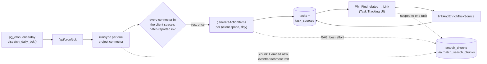
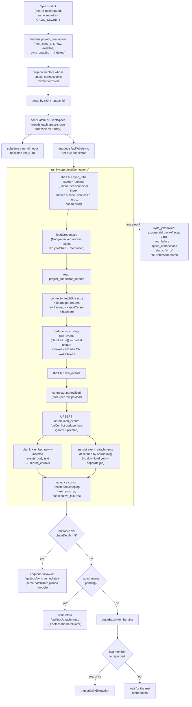
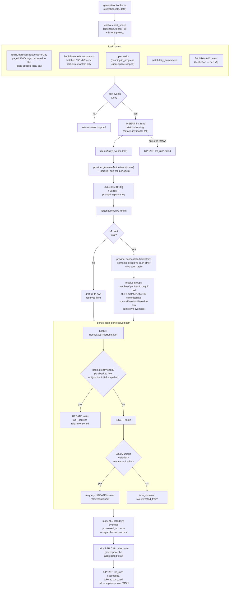
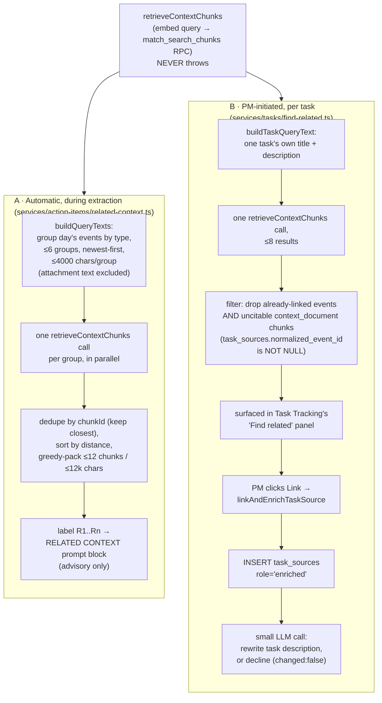

# Connector Sync → Task Extraction → Related-Item Discovery

Traces the full path from a connector's raw API response to a row in `tasks`,
plus the two separate places semantic retrieval gets used along the way. This
is reference documentation, not a design doc — it describes what the code
currently does and why, so read the linked files for anything this glosses
over.

## Overview

Three independent phases:

1. **Connector sync** — pulls provider data in, writes `normalized_events`,
   and coordinates when a client space's day is "done" ([§1](#1-connector-sync)).
2. **Action item extraction** — turns a day's events into `tasks` rows via an
   LLM, using retrieval as an optional assist ([§2](#2-action-item-extraction)).
3. **Related-item discovery** — one shared retrieval primitive with two
   different consumers, automatic (inside extraction) and PM-initiated
   ([§3](#3-related-item-discovery)).

---

## 1. Connector sync

Entry point: `src/app/api/cron/tick/route.ts`, hit once/day by Postgres'
`dispatch_daily_tick()` via `pg_cron` (Vercel Hobby plan caps cron at once/day
— there is no more frequent tick). Every downstream step, including a
mid-day manual "Sync Now", ultimately funnels through the same `runSync`.

Key mechanics:

- **Unit of sync is the project connector**, not a client-space-wide
  integration: two projects scoping the same Slack channel each run their own
  sync and keep their own cursor.
- **The 45s fetch budget** leaves ~15s of headroom under the route's 60s
  `maxDuration` for the writes that happen after `fetchSince` returns.
- **A connector that can't drain its backlog in one call chains itself** — up
  to 5 hops — rather than waiting for tomorrow's cron tick, which would mean
  a busy mailbox or a large Drive backfill never catches up.
- **The batch is the gate on extraction.** `sync_batches` /
  `sync_batch_members` coordinate "every connector due today for this client
  space has reported a terminal outcome" via two independent compare-and-swap
  updates — no counter arithmetic, no custom RPC. The batch's one-shot
  extraction trigger fires exactly once; a connector that reports in *again*
  later the same day (a second manual sync, or attachment extraction finishing
  late) fires its own catch-up `triggerDailyExtraction` instead of assuming
  someone else covered it.
- **A batch that never completes on its own** (lost job delivery, a hard
  function timeout) is force-completed by a delayed `/api/jobs/batch-timeout`
  job scheduled 2 hours out at batch-seed time.
- **Failure isolation:** an auth failure marks the shared `space_connections`
  grant `error` (affects every project using that grant); anything else
  (a bad channel id, a malformed config) only backs off that one
  `project_connectors` row.
- **Attachments are described, not downloaded, during `normalize()`** — actual
  byte-fetching and text extraction happen in a separate `/api/jobs/attachments`
  job, which is also why that job — not `runSync` itself — settles the batch
  when attachments were found this run (extracted text must land before
  extraction reads it).

Files: [route.ts](src/app/api/cron/tick/route.ts) ·
[run-sync.ts](src/services/sync/run-sync.ts) ·
[batch.ts](src/services/sync/batch.ts) ·
[credentials.ts](src/services/sync/credentials.ts)

---

## 2. Action item extraction

Entry point: `/api/jobs/llm`, enqueued once per `(clientSpaceId, date)` by
`triggerDailyExtraction` above (plus a bounded sweep of older unprocessed
backlog days — capped at 30 distinct days per sweep so a first-time connector
backfill can't fire unbounded LLM spend in one shot). Implemented in
`generateActionItems`.

Key mechanics:

- **Two-step day bucketing.** `utcWindowForDay` over-fetches a full UTC day
  either side of `date`; `projectDayKey` then buckets each row precisely into
  the client space's own local day — PostgREST can't express the timezone
  conversion in one query.
- **`llm_runs` is inserted before the first model call**, so a crash mid-run
  still leaves a traceable `status='running'` row instead of nothing.
- **The model is never trusted blindly.** A consolidation group's
  `matchesOpenItemId` is only honored if it's a real id from the list the
  model was actually given that run; `sourceEventIds` is filtered to ids that
  were genuinely in this run's own batch.
- **Two independent dedup layers.** Semantic consolidation (an LLM judgment
  call) is primary; a hash of the normalized title against
  `tasks_open_dedupe_uniq` is the safety net underneath it — re-checked live
  per iteration so two resolved items landing on the same hash *within the
  same run* merge onto each other instead of both inserting. A unique-violation
  on insert (a genuine concurrent writer) is handled by re-querying and
  updating, not treated as a failure.
- **Provenance, not just output.** `task_sources` records *why* a task exists:
  `created_from` for the originating event(s), `mentioned` for a later merge.
  This is why `llm_runs.input_event_ids` — an old array-based audit column —
  was removed in favor of it; the one thing lost is a record for a run that
  produced zero tasks.
- **Every touched event is marked `processed_at` no matter what** — including
  events that produced zero items — which is what makes a re-run of the same
  day converge instead of resending the same backlog forever.
- **Cost is priced per call, then summed**, never priced once on the
  aggregated token total — at least one supported model re-rates an entire
  call once its input crosses a long-context threshold, and pricing the sum
  once would misattribute that rate to calls that never individually crossed
  it.

Files: [generate.ts](src/services/action-items/generate.ts) ·
[prompt.ts](src/lib/llm/prompt.ts) ·
[schema.ts](src/lib/llm/schema.ts) ·
[types.ts](src/lib/llm/types.ts)

---

## 3. Related-item discovery

One shared primitive, two independent consumers. Both sit on top of
`retrieveContextChunks` ([retrieve.ts](src/services/search/retrieve.ts)),
which embeds a query string and calls the `match_search_chunks` Postgres RPC
(pgvector similarity, optional project scoping, source exclusion, optional
one-per-source dedup). `retrieveContextChunks` **never throws** — retrieval is
an enrichment layered on top of whatever the caller is building, never a
dependency it can fail on.

Key mechanics:

- **A can never write to the database; B always does.** The RELATED CONTEXT
  block A produces is purely advisory — the extraction prompt explicitly
  forbids grounding a new item in it alone, and nothing reads a citation back
  out of the model's output. This is deliberate: an earlier prompt version
  (v4) *did* let the model cite retrieved chunks straight into `task_sources`,
  and that channel was removed in v5 because model-driven citation off
  retrieved context proved unreliable. B is the human-in-the-loop replacement
  — a PM decides what's actually relevant, and only a PM's click produces a
  `task_sources` row from retrieval.
- **Different distance thresholds are used deliberately**, even though both
  currently happen to use the same starting value (`0.65`, unvalidated,
  pending recalibration from real production distances) — a PM scanning
  candidates by eye and a token-budgeted prompt are different consumers that
  may need to diverge in calibration, so the constants are kept independent
  rather than shared.
- **Two separate id spaces get excluded**, in both consumers: a normalized
  event's own id (via `retrieveContextChunks`' own `excludeSourceIds`, which
  only catches `normalized_event`-kind chunks) and an `event_attachment`
  chunk's id (whose `source_id` is the attachment's own id, not its parent
  event's) — missing either would let retrieval hand back something already
  present verbatim elsewhere in the caller's context.
- **Only citable chunks can ever become a link.** A `context_document` chunk
  has no owning `normalized_event`, so `citableEventId` is null and
  `find-related.ts` drops it before it ever reaches the PM — showing a "Link"
  button that can't work would be a dead end.
- **The corpus retrieval draws from is populated by connector sync**, not by
  extraction: `runSync` chunks and embeds newly-inserted `normalized_events`
  bodies (and separately, extracted attachment text) into `search_chunks` via
  `insertChunksForSources`, fire-and-forget through `/api/jobs/embed`. Nothing
  in extraction or PM-initiated retrieval writes to `search_chunks` — they only
  read it.

Files: [retrieve.ts](src/services/search/retrieve.ts) ·
[related-context.ts](src/services/action-items/related-context.ts) ·
[find-related.ts](src/services/tasks/find-related.ts) ·
[enrich.ts](src/services/tasks/enrich.ts) ·
[ingest.ts](src/services/search/ingest.ts)

---

## Reference table

| Stage | Trigger | Entry point | Core logic |
|---|---|---|---|
| Connector sync | pg_cron, once/day (+ manual "Sync Now") | [route.ts](src/app/api/cron/tick/route.ts) | [run-sync.ts](src/services/sync/run-sync.ts) |
| Batch coordination | every connector's sync completing | — | [batch.ts](src/services/sync/batch.ts) |
| Action item extraction | batch complete, or backlog sweep | `/api/jobs/llm` | [generate.ts](src/services/action-items/generate.ts) |
| Automatic RAG (extraction-time) | inside extraction | — | [related-context.ts](src/services/action-items/related-context.ts) |
| PM-initiated related search | "Find related" click | task-management [actions.ts](src/app/(app)/w/[workspaceId]/p/[projectId]/task-management/actions.ts) | [find-related.ts](src/services/tasks/find-related.ts) |
| PM-initiated link + enrich | "Link" click | same actions.ts | [enrich.ts](src/services/tasks/enrich.ts) |
